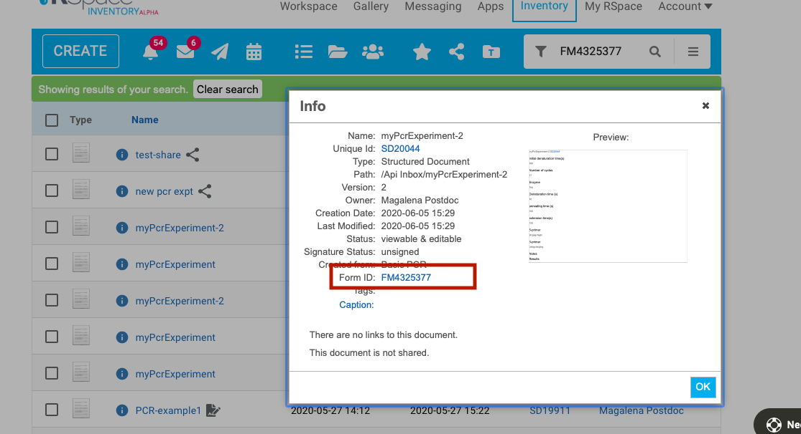

### Polling for events

RSpace does not yet support WebHooks or RestHooks that enable client software to subscribe to event notifications

However, the `/activity` API does supply a listing of document-relared events such as creation, access, editing, signing etc.
Polling of the `/activity` endpoint can be used to detect changes.

### Example use case

You are interested in listening to changes in an RSpace document created from a particular form.
When these documents are altered, you would like your client software to receive the edited documents, along with any file attachments

### Solution

1. Manually, Look up the ID of the form used to create the documents. You can see this in the 'Info' popup of such a document. 

### Pseudo-code
A usable polling interval would be in the range of 1-15 mins.

Every poll interval:

```
     ## Query /activity endpoint, e.g.
     curl -X GET "$RSPACE_URL/api/v1/activity?actions=WRITE&domains=RECORD" -H "accept: application/json" -H "apiKey: $API_KEY"
  
       ### 1. filter for new events (i.e. where the timestamp is later than last polling time)
       ### 2. record the timestamp of the most recent event.

       ### 3. parse the document id out of the payload.id property, extracting the number following 'SD':
         "totalHits": 70,
         "pageNumber": 0,
         "activities": [
          {
            "username": "mpostdoc",
            "fullName": "Magalena Postdoc",
            "domain": "RECORD",
            "action": "WRITE",
            "timestamp": "2021-03-06T12:15:03.184Z",
            "payload": {
              "id": "SD26813",
              "name": "HelloDoc2",
              "type": "NORMAL",
              "userVersion": {
                "version": "3"
            }
          },
          "_links": []
         },.....

       ### 4. Retrieve the document by its ID
       curl -X GET "$RSPACE_URL/api/v1/documents/26813" -H "accept: application/json" -H "apiKey: $API_KEY"

       ### 5. Inspect  the embedded form data, and filter for documents created from the Form of interest.
          form": {
            "id": 4325377,
            "globalId": "FM4325377",
            "stableId": "1590584800008null",
            ....
          }

       ### 6. Iterate over fields in the document and retrieve attachments from links in the 'files' property. The 'enclosure' link downloads the file contents,
       with response header application/octet-stream .

        "files": [
          {
            "id": 14823,
            "globalId": "GL14823",
            "name": "RUILI2b.xls",
            "caption": null,
            "contentType": "application/vnd.ms-excel",
            "created": "2019-04-14T20:38:59.980Z",
            "size": 48640,
            "version": 1,
            "_links": [
              {
                "link": "https://demos.researchspace.com/api/v1/files/14823",
                "rel": "self"
              },
              {
                "link": "https://demos.researchspace.com/api/v1/files/14823/file",
                "rel": "enclosure"
              }
            ]
         }
```

