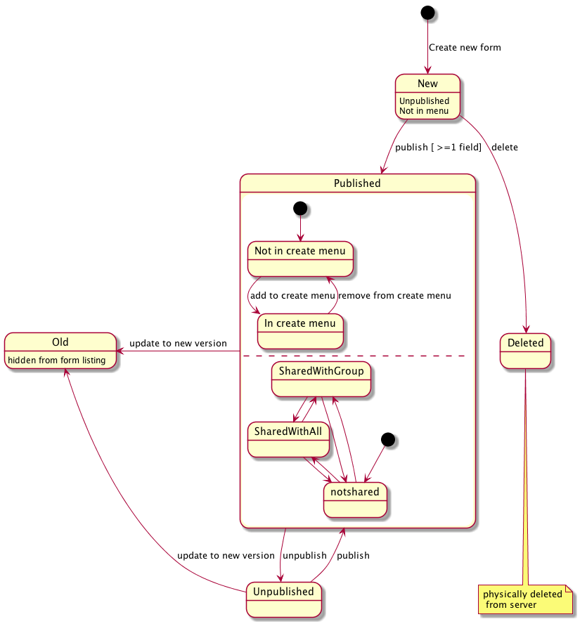

From RSpace 1.50 (API version 1.4) you can programmatically create forms.

## Background

Before we start with the API calls it's instructive to look at how Forms are modelled in RSpace.

In the UI, initially you create a form and add some fields to it. It is in the `NEW` state here as it has not 
 been used to create any documents. You can delete it at this stage, or make incremental edits to the field
 definitions.
 
 In order to make the form available to create documents, you **publish** the form. This creates version 1 of the Form and documents can now be created using the form (once you've added it to the create menu). You can also share the form with your group, if you want your group to re-use your form.
 
 If you make edits to the form now, RSpace will create a new version, and the previous version will become `OLD` and no longer be available for creating new documents.
 
 If you want to make a form no longer usable for creating new documents, you can unpublish it.
 
## Forms in the API

In the API we've simplified somewhat the interactions available in the UI. You create a form in one go, supplying all the Field definitions in a single `POST` request. You can then control publishing and sharing in subsequent operations.

An example of a new form JSON to include in the request body is in the [tutorial-data](tutorial-data/forms/createNewForm.json)

    curl -X POST -H "content-type: application/json" -H "apiKey:<APIKEY>" \
      -d "@tutorial-data/forms/createNewForm.json" "<RSPACE_URL>/api/v1/forms"
      
 The returned JSON will show that the newly created form is in the `NEW` state. From here you can publish  or share using simple `PUT` requests using the ID of the form.
 
    curl -X PUT -H "content-type: application/json" -H "apiKey:<APIKEY>" \
      "<RSPACE_URL>/api/v1/forms/<ID>/publish"
      
     curl -X PUT -H "content-type: application/json" -H "apiKey:<APIKEY>" \
      "<RSPACE_URL>/api/v1/forms/<ID>/share"
      
Notice that the available actions are included in the _links  property. These actions require valid permissions, so if  you are not the owner of the Form then these actions will not be available.
      
The 'share' action is simplified - it will share the form with your group. Sharing with everyone is not permitted through the API.

For end-users to use the forms, they'll have to add the form to their Create menu, as usual.

### Deleting forms

Forms in the `NEW` state, or forms that have been published, but not yet used to create documents, may be deleted. Deletion will remove the form completely from the RSpace database.

You can delete a form as follows:

    curl -v  -X DELETE  -H "apiKey: <APIKEY>"\
      "<RSPACE_URL>/api/v1/forms/<ID>"

If a form cannot be deleted (perhaps because it has been used to create documents), a `422` status code will be returned.
      
 