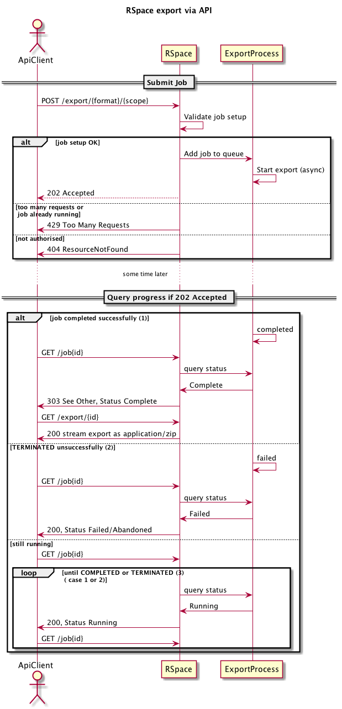

From RSpace 1.47 (API version 1.3) you can programmatically export your work in HTML or XML format. This 
might be useful if you want to make scheduled backups, for example. If you're an admin or PI you can export
a particular user's work if you have permission.

Because export can be quite time-consuming, this is an _asynchronous_ operation. On initial export you will receive a link to 
a **job** that you can query for progress updates. When the export has completed there will be a link to
access the exported file - which may be very large.

The diagram below shows the process, along with the status codes at each step. We'll explain each step in turn.

### Initial submission

The initial export call is a `POST` request to `export/{format}/{scope}` where `format` is one of 'html' or 'xml'
and `scope` is 'user' or 'group'. You can optionally specify a user or group ID. If you don't you'll
export your own work or your own group's work (group export is only available to  PIs). E.g. to export
your own work in HTML:

    curl -X POST -v -H "apiKey: $APIKEY"  "$RSPACE_URL/api/v1/export/html/user/"
    
 All being well, you'll receive a 202 Accepted response, job id and a link to a job to query subsequent progress:
 
 
    {
     "id": 23,
     "status": "STARTING",
     "_links": { [
      "rel": "self",
      "link": "https://myrspace.com/api/v1/jobs/23"
      ] }
     }
     
 You can use this link to periodically assess progress:
 
     curl -v -H "apiKey: $APIKEY"  "$RSPACE_URL/api/v1/jobs/23"
 
Export may take a  few minutes, so we'd recommend checking for completion  no more frequently than once 
per minute.

There are 3 statuses that indicate termination:

* COMPLETED indicates success.
* FAILED indicates that export failed for some reason
* ABANDONED indicates that export was unable to proceed.

All calls to `job/{id}` return a 200 response regardless of the state of the underlying job - the 200 refers
 to the job status retrieval, not that of the underlying process. So it's important to only use the `status` property
  to decide if the job has terminated or not.
  
If the job has completed you'll get additional information about the export process, including the size (in bytes):

     {
      "id": 23,
      "status": "COMPLETED",
      "result": {
        "checksum": "abcde12345",
        "algorithm": "CRC32",
        "size": 1024,
        "expiryDate": "2017-11-25T00:00:00.000Z"
       },
      "_links": [{
        "rel": "enclosure",
        "link": "https://myrspace.com/api/v1/export/export123.zip"
        }]
    }
    
 The enclosure link can then be used to access the download:

    curl -v -H "apiKey: $APIKEY"  -H "accept: application/octet-stream" "$RSPACE_URL/api/v1/export/export123.zip"
